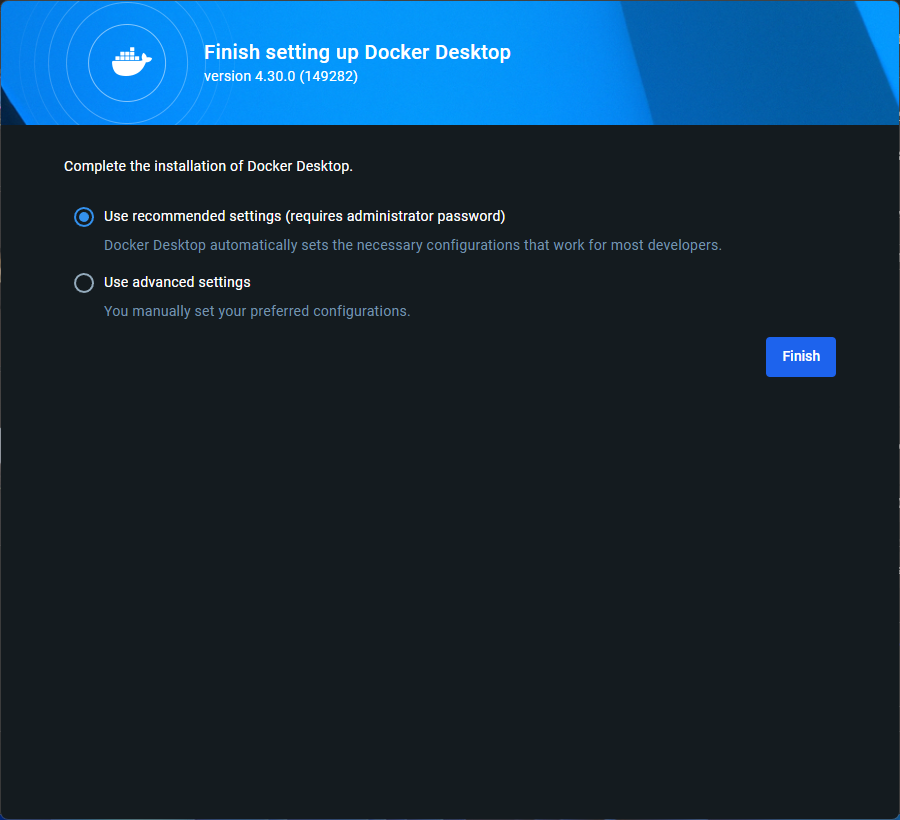
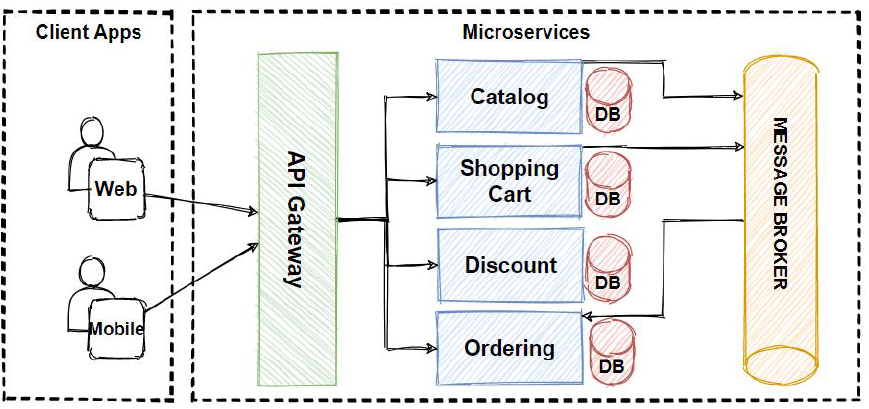
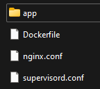

# Docker

## What is Docker?

## Why should we use Docker?

## When should we use Docker?

## How can we use Docker?

### Docker Installation Guide
1. Download the latest Docker installer [here](https://www.docker.com/products/docker-desktop/). Ensure that you select the correct version for your machine.
2. Run the installer.
3. Restart your PC when prompted.
4. You should be greeted with this screen once you have restarted your PC.<br>
   <br>
5. Press Finish.
6. Congratualations. You have now installed Docker.

## Microservices Architecture

## Docker Architecture


## Docker Commands
`docker run -d`: Creates and starts a new container from a Docker image. The -d means detached mode, this will run your container in the background.

`docker images`: Lists all downloaded Docker images on your system.

`docker stop`: Halts a running container.

`docker start`: Resumes a stopped container.

`docker ps`: Shows running containers.

`docker ps -a`: Displays all containers, including stopped ones.

`alias docker="winpty docker"`: Sets up a shortcut for running Docker commands on Windows systems.

`docker exec -it container_id bin/bash`

`docker rm`

`docker rmi`

### Configuring a new docker image to have the basics that I am used to having:
```
apt-get update -y
apt-get upgrade -y
apt-get install sudo -y
apt-get install nano -y
```


### Commiting a running docker container to an image on a DockerHub repository.
```
docker ps
docker commit container_id dockerhub_username/docker_repo:latest
docker images
docker tag image_id dockerhub_username/docker_repo:latest
docker push dockerhub_username/docker_repo:latest
```


## Containerising the Sparta Test App using Docker

1. Create a Dockerfile in the same folder as your app code.
   My directory looked like this:

   

2. You will need to have an nginx.conf file, and a supervisord.conf file.
   
   ```
   server {
    listen 80;

    location / {
        proxy_pass http://localhost:3000;
        proxy_http_version 1.1;
        proxy_set_header Upgrade $http_upgrade;
        proxy_set_header Connection 'upgrade';
        proxy_set_header Host $host;
        proxy_cache_bypass $http_upgrade;
    }
   }
   ```

   ```
   [supervisord]
   nodaemon=true

   [program:nginx]
   command=nginx -g "daemon off;"

   [program:node]
   command=node app.js
   ```

3. Use the following code within the Dockerfile
   ```
   FROM node:latest
   RUN apt-get update && apt-get install -y nginx supervisor

   COPY nginx.conf /etc/nginx/nginx.conf
   WORKDIR /usr/src/app

   COPY ./app /usr/src/app

   RUN npm install

   EXPOSE 80
   EXPOSE 3000

   COPY supervisord.conf /etc/supervisor/conf.d/supervisord.conf

   CMD ["/usr/bin/supervisord"]
   ```

4. Use the following commands to run the Sparta App:
   
   `docker build -t martin-sparta-app .`

   `docker run -d -p 80:80 -p 3000:3000 martin-sparta-app`

5. Push to dockerhub
   
   Use the process outlined [here](https://github.com/Martin-Muraskovas/microservices_learning/blob/main/docker/readme.md#commiting-a-running-docker-container-to-an-image-on-a-dockerhub-repository)