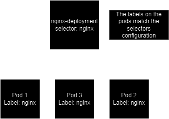
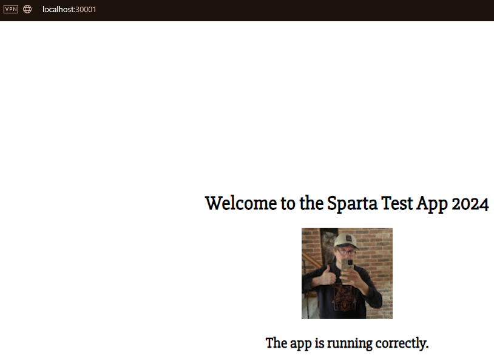

# Kubernetes
## What is Kubernetes?
- Kubernetes is an open-source platform for automating the deployment, scaling, and management of containerized applications.

## Why should we use Kubernetes?
- Orchestration of containerized applications for efficient management at scale.
- Automated scaling and self-healing capabilities.
- Simplifies the deployment and management of microservices architectures.

## When should we use Kubernetes?
- When managing complex applications that consist of multiple containers.
- For scaling applications horizontally and efficiently handling high traffic.
- To ensure high availability and fault tolerance of applications.

## How can we use Kubernetes?
- Define application components and their dependencies in Kubernetes manifests (YAML files).
- Create deployments, services, and pods to run and manage applications.
- Use kubectl commands to interact with the Kubernetes cluster.

## Virtual Machines vs. Kubernetes Pods
- Virtual machines emulate physical hardware, while Kubernetes pods are groups of one or more containers sharing network and storage resources.

## Kubernetes Volumes
- Kubernetes volumes allow containers to persist data beyond the life cycle of individual pods, providing storage for applications.

## Kubernetes Logs
- Kubernetes logs capture the output and events from pods and containers, aiding in troubleshooting and monitoring application behavior.

## Development Environment with Kubernetes
- Kubernetes facilitates consistent development environments by defining application configurations in manifests and deploying them in clusters.

## Kubernetes Dashboard
### What is Kubernetes Dashboard?
- Kubernetes Dashboard is a web-based user interface for visualizing and managing Kubernetes clusters.

### Why should we use Kubernetes Dashboard?
- Provides a graphical interface for monitoring cluster resources and managing applications.
- Simplifies the monitoring and troubleshooting of Kubernetes deployments.

### When should we use Kubernetes Dashboard?
- When visualizing resource allocation, monitoring application health, and managing cluster resources.
- To simplify the management and deployment of applications through a user-friendly interface.

### How can we use Kubernetes Dashboard?
- Access the dashboard by running `kubectl proxy` and opening the dashboard URL in a web browser.
- View and manage cluster resources, monitor application health, and perform administrative tasks through the dashboard.

## Kubernetes Installation Guide
1. Download the latest version of kubectl and minikube for your operating system.
2. Install kubectl by following the official installation guide.
3. Install minikube by following the official installation guide.
4. Start a local Kubernetes cluster using minikube.
5. Verify the cluster is running with `kubectl get nodes`.
6. Congratulations! You have now set up a local Kubernetes cluster.


## Kubernetes Architecture

### Example of a Kubernetes deployment
```
---
apiVersion: apps/v1
kind: Deployment
metadata:
  name: nginx-deployment
spec:
  selector:
    matchLabels:
      app: nginx
  replicas: 3
  template:
    metadata:
      labels:
        app: nginx
    spec:
      containers:
      - name: nginx
        image: martinmuraskovas/nginx-martin:latest
        ports:
        - containerPort: 80
```

### Architecture Overview:
- Replicas: 3 replicas of the nginx application.
- Selector: Used to select Pods based on labels. In my case, it selects Pods with the label app: nginx.
- Template: Defines the structure for the Pods created by the Deployment. It includes the Pod's labels and containers.
- Containers: Contains the configuration for the nginx container, including the image to use and the port to expose.

### Labels and Selectors:
- Labels: Key-value pairs attached to Kubernetes objects (like Pods). They are used to organize and select subsets of objects.
- Selectors: Define how you select objects based on their labels. They are used to link resources like Deployments with Pods.

### Diagram of Kubernetes Architecture


### Step by Step explanation of my nginx deployment
1. **apiVersion:** Specifies the version of the Kubernetes API being used.
2. **kind:** Defines the type of Kubernetes resource being created (Deployment in this case).
3. **metadata:** Contains information about the Deployment, such as its name.
4. **spec:**
   - **selector:** Defines how Pods are selected. In this case, it selects Pods with the label `app: nginx`.
   - **replicas:** Specifies the desired number of replicas (3 in your case).
   - **template:** Defines the Pod template.
     - **metadata:** Includes labels for the Pod.
     - **spec:** Specifies the Pod's specification.
       - **containers:** Contains configuration for the containers in the Pod.
         - **name:** Name of the container.
         - **image:** Specifies the Docker image to use.
         - **ports:** Specifies the ports to expose.

### Services

```
---
apiVersion: v1
kind: Service
metadata:
  name: nginx-svc
  namespace: default
spec:
  
  ports:
    - nodePort: 30001
      port: 80
      targetPort: 80

  selector:
    app: nginx
    
  type: NodePort
```


- `kubectl edit deploy nginx-deployment`

    Make live changes without the deployment having to come down


## Deploying the Sparta Test app using Kubernetes

### Create a Deployment file
```
---
apiVersion: apps/v1
kind: Deployment
metadata:
  name: node-app-deployment
spec:
  replicas: 2
  selector:
    matchLabels:
      app: node-app
  template:
    metadata:
      labels:
        app: node-app
    spec:
      containers:
        - name: node-app
          image: martinmuraskovas/martin-node-app
          ports:
            - containerPort: 3000
```
### Creat a Service file
```
---
apiVersion: v1
kind: Service
metadata:
  name: node-app-service
spec:
  selector:
    app: node-app
  ports:
    - protocol: TCP
      port: 3000
      targetPort: 3000
      nodePort: 30001
  type: NodePort
```

### Deploy your deployment and service
Use the following commands to deploy your deployment and your service:

`kubectl apply -f deployment.yml`

`kubectl apply -f service.yml`

### Result
The node app is running on the nodeport that we set up in our service file:




## Implementing a 2-tier architecture in Kubernetes

### MongoDB Deployment and Service
- **MongoDB Deployment**:
  - Deploys MongoDB with 2 replicas.
  - Uses the image `martinmuraskovas/mongo_db_martin`.
  - Exposes port 27017.

- **MongoDB Service**:
  - Creates a ClusterIP service named `mongo-service` for MongoDB.
  - Routes traffic to port 27017.

```
---
apiVersion: apps/v1
kind: Deployment
metadata:
  name: mongo-deployment
spec:
  replicas: 2
  selector:
    matchLabels:
      app: mongodb
  template:
    metadata:
      labels:
        app: mongodb
    spec:
      containers:
        - name: mongodb
          image: martinmuraskovas/mongo_db_martin
          ports:
            - containerPort: 27017

---
apiVersion: v1
kind: Service
metadata:
  name: mongo-service
spec:
  selector:
    app: mongodb
  ports:
    - protocol: TCP
      port: 27017
      targetPort: 27017
  type: ClusterIP
```

### Node.js App Deployment and Service
- **Node.js App Deployment**:
  - Deploys Node.js app with 2 replicas.
  - Uses the image `martinmuraskovas/martin-node-app`.
  - Exposes port 3000.
  - Sets the environment variable `DB_HOST` to `mongodb://mongo-service:27017/posts`.

- **Node.js App Service**:
  - Creates a NodePort service named `node-app-service` for the Node.js app.
  - Routes external traffic to port 30001, internal traffic to port 3000.

```
---
apiVersion: apps/v1
kind: Deployment
metadata:
  name: node-app-deployment
spec:
  replicas: 2
  selector:
    matchLabels:
      app: node-app
  template:
    metadata:
      labels:
        app: node-app
    spec:
      containers:
        - name: node-app
          image: martinmuraskovas/martin-node-app
          ports:
            - containerPort: 3000
          env:
          - name: DB_HOST
            value: mongodb://mongo-service:27017/posts

---
apiVersion: v1
kind: Service
metadata:
  name: node-app-service
spec:
  selector:
    app: node-app
  ports:
    - protocol: TCP
      port: 3000
      targetPort: 3000
      nodePort: 30001
  type: NodePort
```

### Horizontal Pod Autoscaler (HPA) for Node.js App
- **Horizontal Pod Autoscaler (HPA)**:
  - Scales the Node.js app deployment based on CPU and memory utilization.
  - Targets the `node-app-deployment`.
  - Sets a minimum of 2 replicas and a maximum of 3 replicas.
  - Scales when average CPU and memory utilization reaches 50%.

```
---
apiVersion: autoscaling/v2beta2
kind: HorizontalPodAutoscaler
metadata:
  name: node-app-hpa
spec:
  scaleTargetRef:
    apiVersion: apps/v1
    kind: Deployment
    name: node-app-deployment
  minReplicas: 2
  maxReplicas: 3
  metrics:
  - type: Resource
    resource:
      name: cpu
      targetAverageUtilization: 50
  - type: Resource
    resource:
      name: memory
      targetAverageUtilization: 50
```

### Persistent Volume for MongoDB
- **Persistent Volume (PV) for MongoDB**:
  - Creates a 10Gi hostPath PV named `mongo-pv`.
  - Provides ReadWriteOnce access mode.
  - Retains the PV data even after the claim is deleted.
  - Uses the `standard` storage class.
  - Mounts the volume at `/mnt/data`.

```
---
apiVersion: v1
kind: PersistentVolume
metadata:
  name: mongo-pv
spec:
  capacity:
    storage: 10Gi
  accessModes:
    - ReadWriteOnce
  persistentVolumeReclaimPolicy: Retain
  storageClassName: standard
  hostPath:
    path: /mnt/data
```